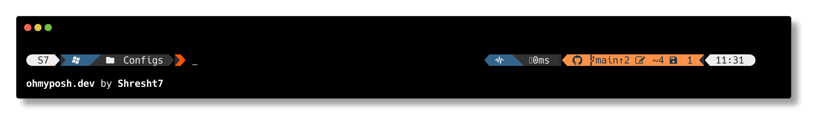

# PowerShell

## PowerShell Profile

[About PowerShell Profile](https://docs.microsoft.com/en-us/powershell/module/microsoft.powershell.core/about/about_profiles?view=powershell-7.2)s

[`Microsoft.PowerShell_profile.ps1`](Microsoft.PowerShell_profile.ps1)

## Oh-My-Posh

https://ohmyposh.dev/

Oh-My-Posh is a prompt engine for PowerShell.

### Theme

[`s7.omp.yaml`](Themes/s7.omp.yaml)

---

## 📕 References

- https://learn.microsoft.com/en-us/powershell/
